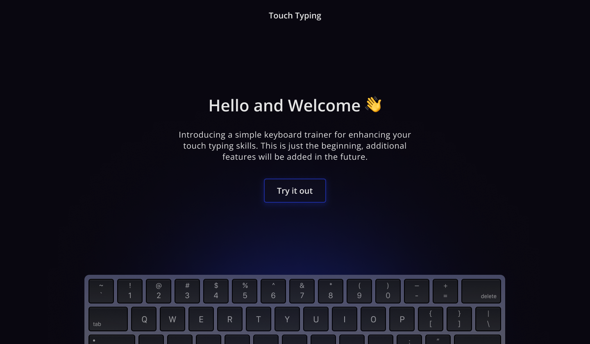

# Touch Typing

Introducing a simple keyboard trainer for enhancing your touch typing skills.

## Demo 🚀

[https://touch-typing-ruby.vercel.app/](https://touch-typing-ruby.vercel.app/)

## Get Started

### Prerequisites

1. Git
1. Node: any 12.x version starting with v12.0.0 or greater
1. Yarn v1: See [Yarn website for installation instructions](https://yarnpkg.com/lang/en/docs/install/)
1. A fork of the repo (for any contributions)
1. A clone of the [repo](https://github.com/paragkatoch/TouchTyping) on your local machine

### Installation

1. `cd TouchTyping` to go into the project root
2. `yarn` to install the website's npm dependencies

### Running locally

1. `yarn build` to build the application (powered by [Next.js](https://nextjs.org/))
2. `yarn start` to start the server
3. `open http://localhost:3000` to open the site in your favorite browser

## Todo

- [x] Home Page
- [x] Profile Page
- [x] Trainer Page
- [x] Result
- [x] Redux Store
- [x] Animations
- [x] Documentation
- [ ] Responsiveness
- [ ] Final Checks

## Technologies

1. Next.js
2. React
3. SCSS
4. HTML & CSS

## Inspiration

1. [Keybr](https://keybr.com)
2. [Typing School](https://typing.school)
3. [Ngram](https://ranelpadon.github.io/ngram-type/)
4. Dribble

## Platform used

1. VSCode
2. Figma
3. Github
4. Vercel
